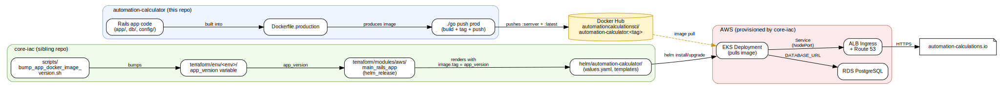
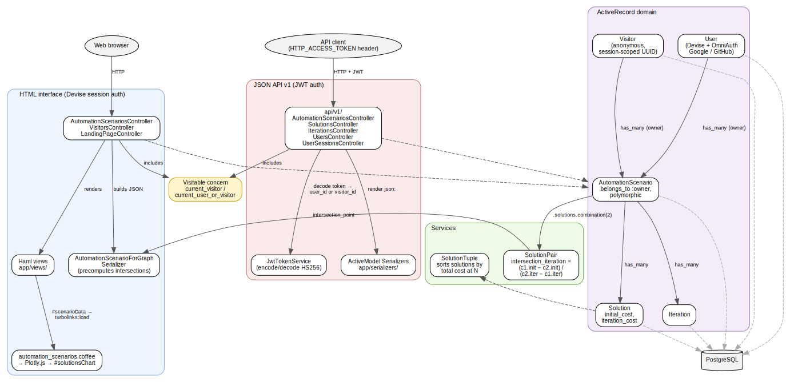

 

# automation-calculator

## Purpose

To help people make and communicate automation decisions quickly and effectively. 

[Examples of automation decisions.](https://github.com/team-automation-calculator/automation-calculator/blob/master/About.md)

## Setup
### Dependencies
* Ruby 2.0.0+
* Docker Engine 17.09.0+
* Docker Compose (Must support Compose 3.4 format)

### Install
`./go init`

## Use

### View app in local browser
* `./go start`
* Open browser, go to `http://localhost:3001/`.
* If you wish to configure the port to be something else, edit `RAILS_SERVER_PORT` inside `docker-compose.yml`.

### Interact with the app via terminal
* `./go shell`

### Run the tests
* `./go test`
* `./go lint`

### View available functions
* `./go help`

## Relationship to `core-iac`

This repo holds the Rails application code. The sibling [`core-iac`](../core-iac) repo holds the Infrastructure as Code (Terraform + Helm) that runs that code as the live site at [automation-calculations.io](https://automation-calculations.io).

### How the two repos connect

The two repos meet at a Docker image on Docker Hub:

The Graphviz source is at [`docs/repo-relationship.dot`](docs/repo-relationship.dot); see the header of that file for the render command.

1. **Build & publish (this repo).** `./go build prod` produces a production image from `Dockerfile.production`. `./go push prod` tags it as both `:latest` and a semver tag (e.g. `0.9.6-830`) and pushes both to `automationcalculationsci/automation-calculator` on Docker Hub. The image repository name is defined in `scripts/docker_hub.rb` as the `REPO` constant.
2. **Deploy (core-iac).** The Helm chart at `core-iac/helm/automation-calculator/` defines the Kubernetes resources (Deployment, Service, Ingress, ConfigMap, Secret). Its `values.yaml` points `image.repository` at the same Docker Hub repo above; the Terraform module `core-iac/terraform/modules/aws/main_rails_app/` renders the chart with `image.tag = var.app_version`.
3. **Version bump.** When a new image is pushed, `core-iac/scripts/bump_app_docker_image_version.sh` (or the `_branch.sh` variant) updates the `app_version` variable in the per-environment Terraform configs under `core-iac/terraform/env/<env>/`. A Terraform apply then triggers a new `helm_release` rollout, which causes Kubernetes to pull the new image tag.
4. **Surrounding infrastructure (core-iac only).** Beyond the app workload, `core-iac` also provisions the VPC, EKS cluster, RDS PostgreSQL database, ALB ingress controller, and DNS — none of which live in this repo. The Rails app connects to the database via the `DATABASE_URL` secret rendered into the Helm release.

### What lives where

| Concern | Repo |
|---|---|
| Rails app code, migrations, assets, tests | `automation-calculator/` (this repo) |
| Dockerfiles for the app image | `automation-calculator/` (this repo) |
| Helm chart describing the Kubernetes Deployment/Service/Ingress | `core-iac/helm/automation-calculator/` |
| Terraform for AWS (VPC, EKS, RDS, IAM) and the app's `helm_release` | `core-iac/terraform/` |
| The image tag currently deployed to each environment | `core-iac/terraform/env/<env>/` |

A change to a Ruby file → ship via this repo (build + push a new image, then bump `app_version` in `core-iac`). A change to how the app is deployed or to its surrounding cloud resources → ship via `core-iac` alone.

## App structure

Inside this repo the Rails app exposes the same domain through two parallel stacks — an HTML interface with Devise session auth and a versioned JSON API with JWT auth — that share a single ActiveRecord domain. `AutomationScenario` belongs to a polymorphic `owner` (either a `User` or an anonymous `Visitor`), and the break-even math lives in the `SolutionPair` service.

The Graphviz source is at [`docs/app-structure.dot`](docs/app-structure.dot); render command is in the header.

Things worth knowing that the diagram does not spell out:

- **Visitor pattern.** The `Visitable` controller concern provides `current_visitor` / `current_user_or_visitor` so unauthenticated users can use the app immediately. A `Visitor` record (UUID + IP) is created on first visit and stored in `session[:visitor_id]`. Scenarios are *not* migrated to a `User` on signup.
- **Chart data handoff is server-rendered, not API-driven.** The scenario show view embeds the output of `AutomationScenarioForGraphSerializer` (including pre-computed intersection points) into a hidden `#scenarioData` element; `automation_scenarios.coffee` reads it on `turbolinks:load` and renders Plotly traces into `#solutionsChart`. The HTML page does not call the JSON API for chart data.
- **Break-even formula.** `SolutionPair#intersection_iteration` solves `(initial_cost₁ − initial_cost₂) / (iteration_cost₂ − iteration_cost₁)`, and `Solution#cost_at(n) = initial_cost + iteration_cost * n` is the linear cost line each pair intersects.

## Troubleshooting/Gotchas

* Problem: If you update the Gemfile and run `./go test`, `./go shell` or a similar command, you will see `Could not find NEW_GEM_DEPENDENCY_NAME_HERE`.
* Solution: Run `./go build` to update your development docker image to include the new dependency.
* Problem: `./go start` starts the development container, but it stops with exit code 1 after a few seconds. You check the logs and see a message like: `A server is already running. Check /usr/src/app/tmp/pids/server.pid`. 
* Solution: Run `./go shell`, `cd /usr/src/app/tmp/pids`, `rm server.pid`. Then exit the shell container and run `./go start` again.
* Problem: You see an error message like `ERROR: Service 'dev' failed to build: The command '/bin/sh -c useradd -ms /bin/bash $username' returned a non-zero code: 2` when running a command like `./go test` or `./go start`. 
* Solution: Run `./go init` before running any other `./go` commands. 
